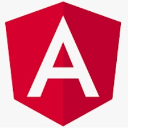

 
<h1 align="center"> Hola MUNDO 👋</h1>
<h2 align="center"> Soy Santiago Pérez Hernández</h2>
<h3 align="center">DESARROLLADOR BACK-END</h3>

 

Soy un desarrollador backend con experiencia en el diseño, desarrollo y mantenimiento de soluciones escalables y eficientes. Mi enfoque principal es crear APIs robustas, microservicios y sistemas distribuidos que ofrezcan alto rendimiento y fiabilidad.

### 🚀 Lo que hago:
- **Desarrollo microservicios en Java** programación concurrente y reactiva.
- **Bases de datos** tanto relacionales como no relacionales, incluyendo MySQL, PostgreSQL y MongoDB.
- **Creación y gestión de APIs RESTful** creación de microservicios utilizando SpringBoot.
- **Programación Python para Airflow** para la automatización de tareas y la integración de flujos de trabajo.
- **Desarrollo de aplicaciones WEB** con PHP y ANGULAR.
- **Aplicaciones ANDROID** mediante MVC y consumo de API con Retrofit.
- **Software ERP** con ABAP y SAP-Logon.
- **Programas de escritorio** con javaFX y SceneBuilder.
- **Creación de VideoJuegos** con la librería LibGDX.
- **Despliegue de aplicaciones** utilizando Jenkins y Kubernetes, con un enfoque en CI/CD.

### 🌱 En constante aprendizaje:
Siempre estoy buscando nuevas oportunidades para mejorar mis habilidades y explorar nuevas tecnologías.

Actualmente, me enfoco en expandir mi conocimiento en contenedores y microservicios para seguir mejorando la eficiencia de los proyectos con los que trabajo. Además estoy descubriendo el diseño WEB con Angular.

### 🌐 Lenguajes de programación:

|  |   |   |   |  |  |  |  | 
|---|---|---|---|---|---|---|---|---|

### 🛠️ Herramientas de trabajo: 

|  |   |  |  |   |   |  |  |  |  |  | | 
|---|---|---|---|---|---|---|---|---|---|---|---|---|

 

### 📫 Contactar conmigo:
 

